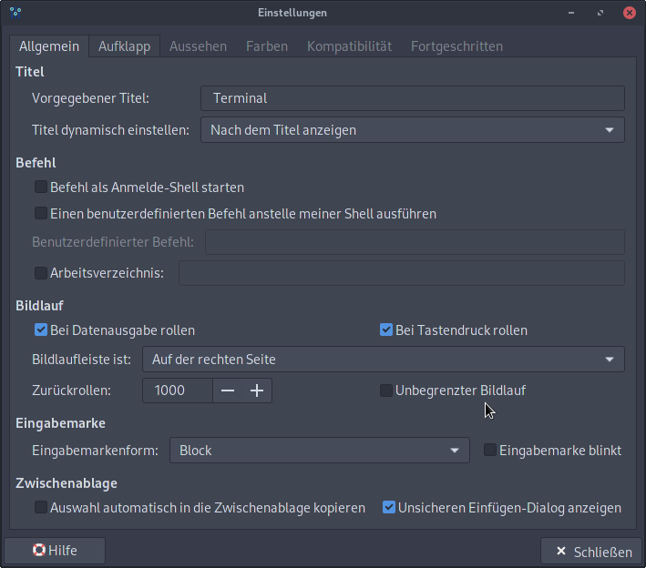
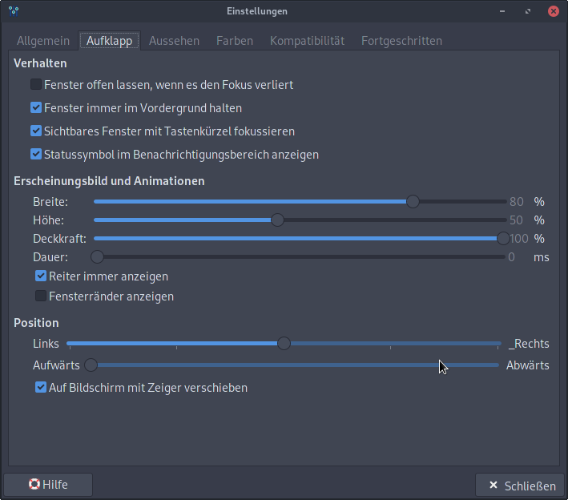
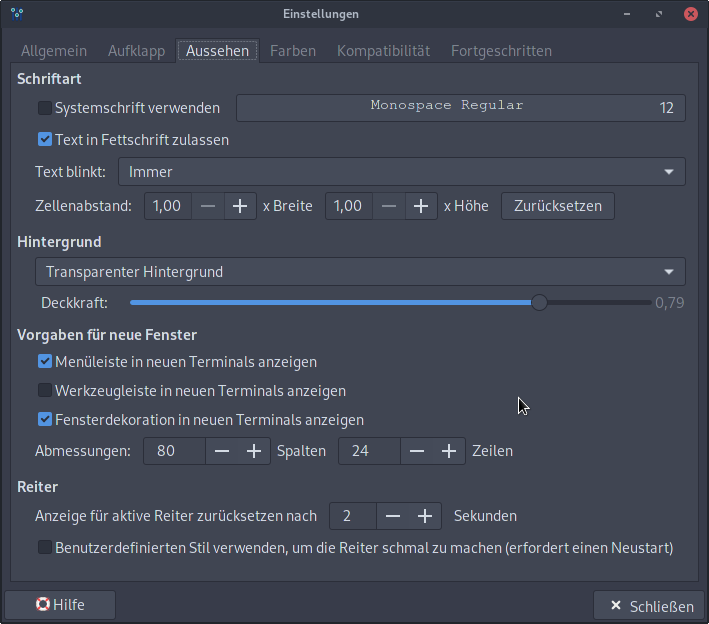
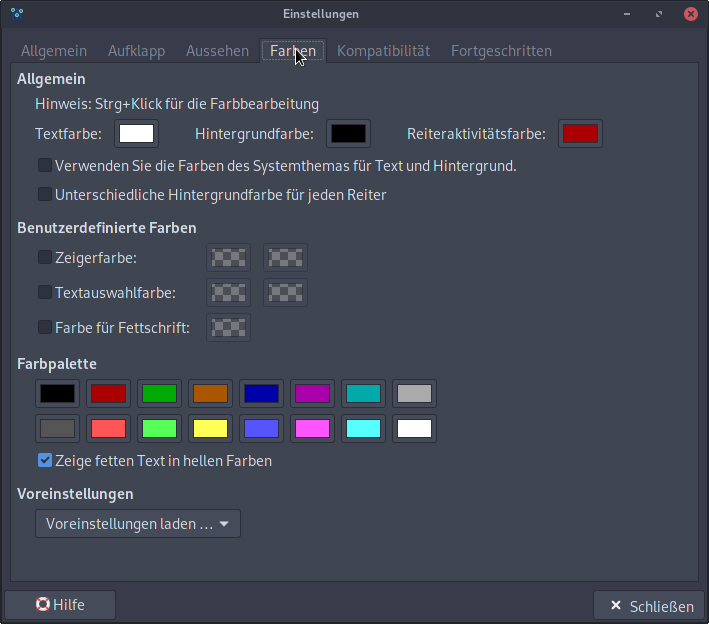
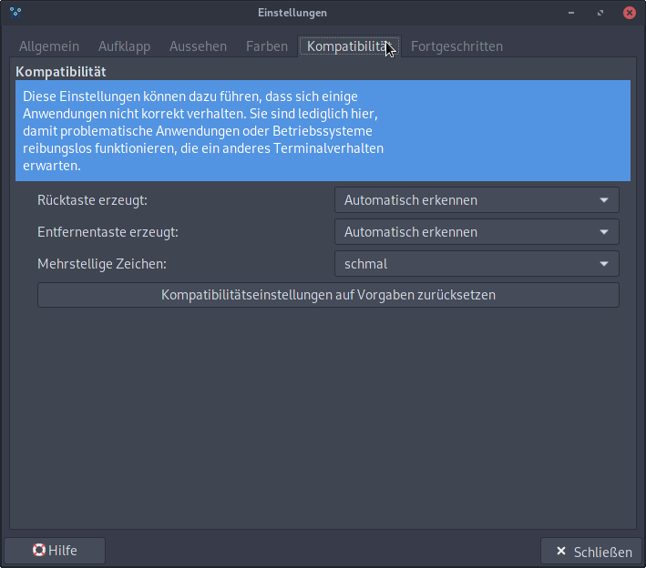
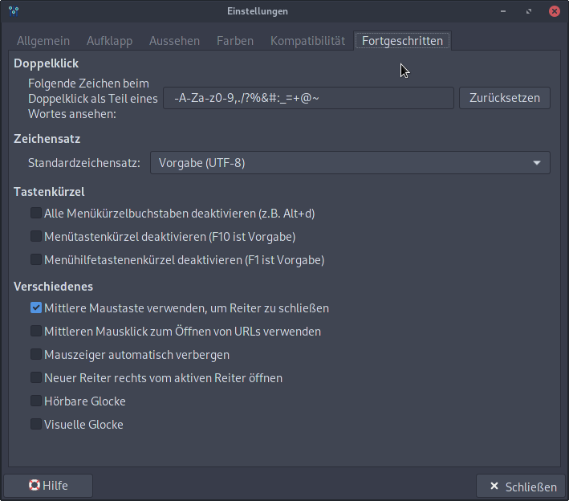

```bash
sudo pacman -S --needed xfce4 xfce4-goodies lightdm lightdm-gtk-greeter lightdm-gkt-greeter-settings (gvfs-afc) udisks2 network-manager-applet
```
```
sudo systemctl enable lightdm
sudo systemctl start lightdm
```
### XFCE Specific Config
```bash
sudo pacman -S xfce4-session xorg-xrandr
sudo pacman -S xfce4-whiskermenu-plugin
sudo yay -S alacarte-xfce (not tested)
yay -S menulibre xame
sudo pacman -S gambas3-gb-gtk3 libcanberra libcanberra-pulse sound-theme-freedesktop

# Description #
# alacarte  # Menu editor for gnome
# menulibre  # An advanced menu editor that provides modern features in a clean, easy-to-use interface
# xame  # XFCE Applications Menu Editor
# gambas3-gb-gtk3  # GTK3 toolkit component
# libcanberra + libcanberra-pulse  # A small and lightweight implementation of the XDG Sound Theme Specification
# sound-theme-freedesktop  # Freedesktop sound theme
```
```
yay -S sound-theme-smooth xfce4-volumed-pulse xfce4-mixer
sudo pacman -S xfce4-pulseaudio-plugin xscreensaver udevil udiskie thunar thunar-volman thunar-archive-plugin thunar-media-tags-plugin

# Description #
# udevil  # Mount and unmount without password
# udiskie  # Removable disk automounter using udisks
```
```
sudo pacman -S tumbler libgsf catfish mlocate  # Thunar Specific Packages
yay -S env-modules # alternatively env-modules-tcl
# yay -S xfce4-sensors-plugin-nvidia - DEPRECATED

Description
# tumbler  # D-Bus service for applications to request thumbnails
# libgsf  # An extensible I/O abstraction library for dealing with structured file formats
# catfish  # Versatile file searching tool
# mlocate  # Merging locate/updatedb implementation
# env-modules/-tcl  # Provides for an easy dynamic modification of a user's environment via modulefile.
```

### XFCE4 Settings

#### Popup Menu on Windows-Icon
In Keyboard Shortcuts set ```xfce4-popup-whiskermenu``` run on windows-key
```
yay -S xfce4-screensaver mugshot gnome-system-tools
```

 To Install this, you need to do some more complicated stuff
```
git clone https://aur.archlinux.org/gnome-system-tools.git
cd gnome-system-tools/
makepkg -si
yay -S gnome-doc-utils
yay -S liboobs -> git clone https://aur.archlinux.org/liboobs.git
cd liboobs
nano PKGBUILD (change FTP (first to HTTP/S)
makepkg -si (maybe edit PKGBUILD)
yay -S system-tools-backends
makepkg -si
```
```
yay -S gnome-system-tools
```
Now Clean Your AUR Clones Directory

### Make XFCE4 look good!**
#### KALI LOOK
**Theme and Fonts - For Kali Look**
```bash
sudo pacman -S arc-gtk-theme arc-icon-theme
yay -S flat-remix cantarel-fonts
# sudo pacman -S futurist - Deprevated
```

**Plank**
```bash
yay -S plank  # Dock like OSX
yay -S plank-theme-arc
```

**Desktop**
1. Right-Clock on Desktop -> Settings:
2. Select *usr/share/backgrounds/archlinux* as background folder and choose a nice background
3. Symbols -> Default Icons:
	* Deselect Home and Filesystem.
	* Iconsize: 40
	* Show icon tooltips. Size: 100

**Theme, Icon and Font**
Settings->Appearance:
1. Style: Arc-Dark
2. Icons: Flat-Remix-Blue-Dark
3. Fonts:
	* Default Font: Cantarel Regular - 11
	* Default Monospace Font: Fira Code Medium - 10
	* Rendering:
		* Hinting: Low (Gering)
		* Sub-Pixel order: RGB

Settings->Window Manager:
1. Style:
	* Style: Arc-Dark
	* Title Font: Cantarel Bold - 9
	* Hide arrow up

For more Themes visit [this Page](https://www.xfce-look.org/)

##### Terminal







**LightDM Settings**
Theme: Arc-Dark
Icon: Arc
Font: Cantarel Bold - 10

**Screensaver**
Settings->Screensaver:
* Floating XFCE
* Disable: Lock Screen with System Sleep
Settings->Keyboard: xflock4 (default Ctrl+Alt+L/Delete)

**Whisker-Menu**
Delete the Old Menu Button and add the installed Wisker Menu to the Top Panel.
Right Click and Open Settings of Whisker Menu:
* List view
* Symbol-Size: Small
* Symbol Category: Smaller
* Head->Symbol only + Symbol -> ArchLinux Symbol
* Behaviour: Select on Hover

Settings->Keyboard->Shortcuts: add on pressing *super* (Windows Button): xfce4-popup-whiskermenu

**More Configuration**
Open Whisker-Menu and Klick on the User Icon:
-> Mugshot should open: Enter your Credentials

In Settings: Type "User" and Open: *User Settings* (gnome-system-tools)
Administrate User and Groups ...

Logout and Login again that the changes take effect.

**Config Light DM Greeter**
```bash
sudo pacman lightdm-webkit2-greeter

# Open /etc/lightdm/lightdm.conf
user-session=awesome # your user-session -> ls /usr/share/xsessions/*.desktop

greeter-session=lightdm-webkit2-greeter
```

**Edit Whisker Menu**
```bash
yay -S menulibre  # Integration to edit Menu Entries in the Whisker Menu
```

#### XFCE MacOZ Look
```
sudo pacman -S gtk-engine-murrine sassc
```

**Github**
* WhiteSur-gtk-theme
* WhiteSur-icon-theme
* WhiteSur-Cursors

**Fonts**
* San Francisco Display Regular
* Iosevka Term Regular

**Packages**
* vala-panel-appmenu-common/registrar/xfce
* appmenu-gtk-module
* xfconf-query -c xsettings -p /Gtk/ShellShowsMenubar -n -t bool -s true
* xfconf-query -c xsettings -p /Gtk/ShellShowsAppmenu -n -t bool -s true

Xpple Menu: https://www.pling.com/p/1529470/

Installing and Configuring Plank Dock
```
sudo pacman -S plank
```

Installing and Configuring Rofi Launcher
```
sudo pacman -S rofi
```

Installing and Configuring Ulauncher
```
pamac build ulauncher
```

Installing and Configuring Conky
```
pamac build conky-lua-nv
sudo pacman -S jq curl
```

Installing and Configuring LightDM-Webkit2-Greeter
```
sudo pacman -S lightdm-webkit2-greeter
```

Installing and Configuring Picom Compositor
```
pamac build picom-ibhagwan-git
```

Installing Comice Control center
```
git clone https://github.com/libredeb/comice-co...
sudo pacman -S util-linux gsettings-desktop-schemas wireless_tools iproute alsa-utils dbus-python
sudo pacman -S python-pip
sudo pip3 install -r requirements.txt
./comice-control-center
```

#### Make XFCE Beautiful**
  [Link](https://www.youtube.com/watch?v=uvvoJU69uNo&t=1s)
